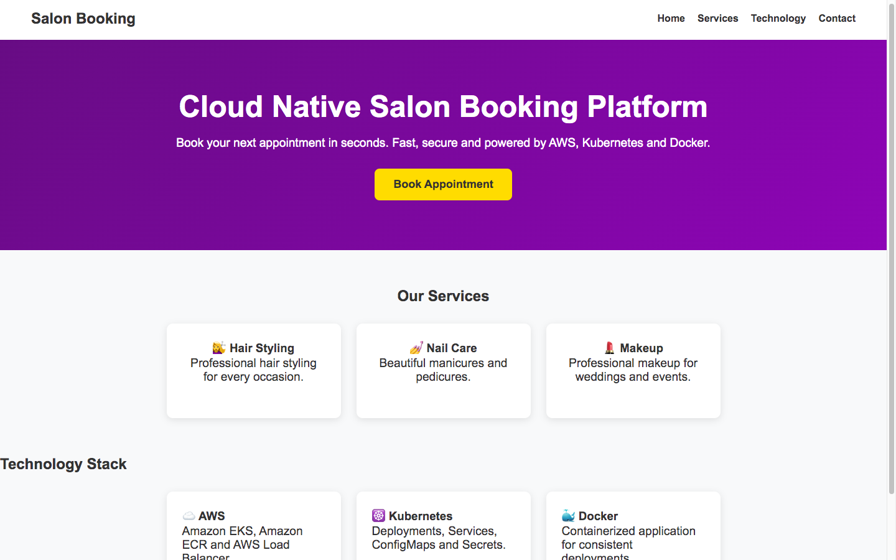
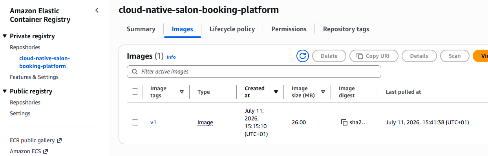
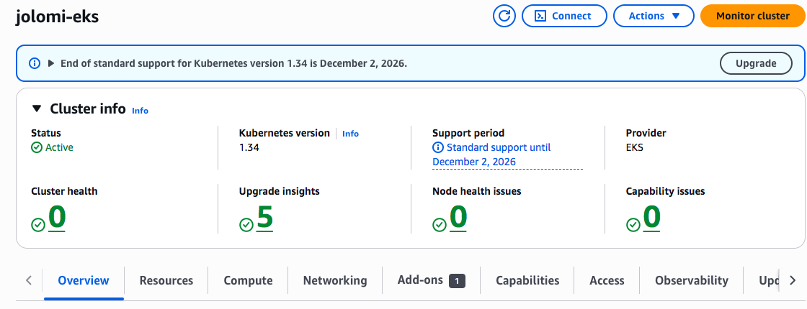
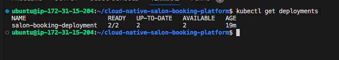
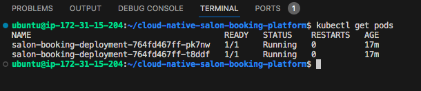
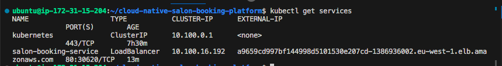

# Cloud Native Salon Booking Platform

A production-style cloud-native web application deployed on *Amazon Elastic Kubernetes Service (EKS)* using *Docker, **Amazon Elastic Container Registry (ECR), and **Kubernetes*.

This project demonstrates modern DevOps practices including containerization, image management, Kubernetes deployments, and exposing applications through an AWS Load Balancer.

---

# Project Overview

This project showcases the deployment of a responsive salon booking website on Kubernetes running in Amazon EKS.

The application is containerized with Docker, stored in Amazon ECR, deployed using Kubernetes Deployments, and exposed externally through a Kubernetes LoadBalancer Service.

---

# Features

- Responsive Salon Landing Page
- Docker Containerization
- Amazon Elastic Container Registry (ECR)
- Amazon Elastic Kubernetes Service (EKS)
- Kubernetes Deployment
- Kubernetes LoadBalancer Service
- High Availability using Multiple Replicas
- VS Code Remote SSH Development

---

# Architecture

                 User
                   │
                   ▼
        AWS Load Balancer
                   │
                   ▼
        Kubernetes Service
                   │
                   ▼
      Kubernetes Deployment
            (2 Replicas)
             │        │
             ▼        ▼
           Pod 1    Pod 2
              \      /
               Docker Image
                    │
                    ▼
             Amazon ECR Repository

---

# Technology Stack

- HTML5
- CSS3
- JavaScript
- Docker
- Amazon ECR
- Amazon EKS
- Kubernetes
- AWS Load Balancer
- Git
- GitHub
- VS Code Remote SSH

---

# Deployment Workflow

1. Build the Docker image.
2. Test the container locally.
3. Push the image to Amazon ECR.
4. Deploy the application to Amazon EKS.
5. Create a Kubernetes Deployment.
6. Expose the application using a LoadBalancer Service.
7. Verify running Pods and Services.

---

# Project Structure

cloud-native-salon-booking-platform/
│
├── backend/
│
├── frontend/
│   ├── index.html
│   ├── style.css
│   └── script.js
│
├── k8s/
│   ├── deployment.yaml
│   └── service.yaml
│
├── screenshots/
│
├── Dockerfile
├── README.md
└── .gitignore

---

# Screenshots

## Application

---

## Amazon ECR Repository

---

## Amazon EKS Cluster

---

## Kubernetes Deployment

---

## Kubernetes Pods

---

## Kubernetes Services

---

# Future Improvements

- Node.js Backend API
- PostgreSQL Database
- Kubernetes ConfigMaps
- Kubernetes Secrets
- GitHub Actions CI/CD
- Helm Charts
- Monitoring with Prometheus & Grafana
- Ingress Controller
- Custom Domain with HTTPS

---

# Skills Demonstrated

- Docker Containerization
- Kubernetes Deployments
- Kubernetes Services
- Amazon ECR
- Amazon EKS
- AWS Load Balancer
- Linux
- Git
- GitHub
- VS Code Remote SSH

---

# Author

*Jolomi Ayu*

Cloud & DevOps Engineer

GitHub: https://github.com/jolomiayu